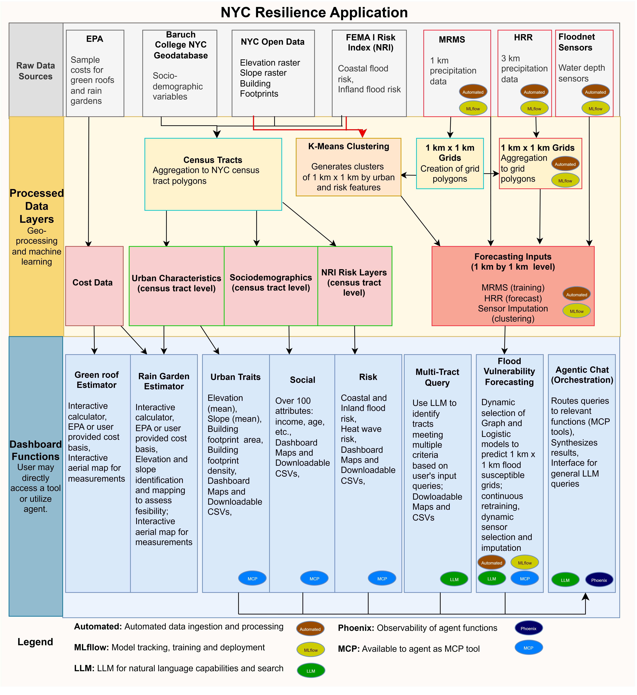
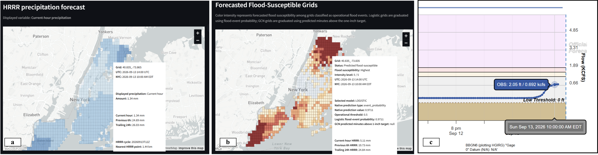
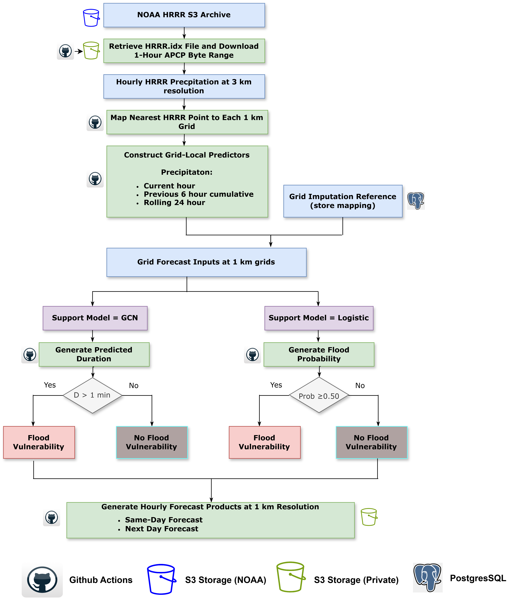
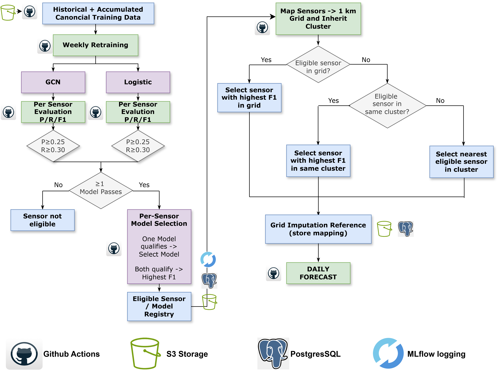

# NYC Resilience — Agentic MLOps Framework

NYC Resilience is an agentic framework for neighborhood-scale climate-risk analysis and flood susceptibility forecasting in New York City. The application integrates geospatial data, automated weather and sensor ingestion, machine-learning workflows, resilience planning tools, and an LLM-based agent within an operational MLOps architecture.

The framework is designed to support both interactive climate-risk exploration and continuously updated flood susceptibility forecasting at 1 km spatial resolution.



*Figure 1. High-level architecture of the NYC Resilience application, from raw data ingestion and processing to forecasting, resilience tools, and agentic orchestration.*

## Application Overview

The NYC Resilience application brings together multiple climate-risk and urban-resilience capabilities within a modular Streamlit interface. Core functionality includes:

- Urban characteristics and geospatial analysis
- Socio-demographic mapping
- Coastal and inland flood-risk exploration
- Flood susceptibility forecasting
- Urban heat-island analysis
- Multi-risk identification
- Green roof and rain garden estimators
- Automated weather and sensor ingestion
- Agent-assisted queries and orchestration

Home, Urban Features, Risk Mapping, Socio-Demographics, Forecasting, Urban Heat Island, Multi-risk Identification Tool, Green Roof Calculator, Rain Garden Estimator, and Claude Chat are registered through `app.py`.

The application combines static urban and risk datasets with dynamic precipitation forecasts and sensor observations. Operational data sources include NOAA HRRR precipitation forecasts, MRMS precipitation data, FloodNet sensors, NYC Open Data, FEMA National Risk Index data, and other geospatial and socio-demographic datasets.

## Flood Susceptibility Forecasting

The forecasting component produces spatially resolved estimates of flood susceptibility across 1 km × 1 km NYC grids. HRRR precipitation forecasts provide current-hour, previous 6-hour cumulative, and rolling 24-hour precipitation predictors.

Depending on the model selected for an eligible sensor, the operational workflow uses either a Graph Convolutional Network (GCN) or logistic model to generate grid-level flood susceptibility outputs.



*Figure 2. Example forecast products showing HRRR precipitation, predicted flood-susceptible grids, and corresponding sensor observations.*

The current outputs should be interpreted as **flood susceptibility rather than deterministic flood-event predictions**. Model calibration and sensitivity analyses are ongoing as the automated ingestion pipeline accumulates a longer FloodNet sensor history.

## Daily Forecasting Workflow

The daily operational workflow retrieves NOAA HRRR precipitation forecasts, maps HRRR information to the application's 1 km grids, constructs grid-local precipitation predictors, applies the selected support model, and generates same-day and next-day forecast products.



*Figure 3. Daily workflow for generating 1 km flood susceptibility forecasts from HRRR precipitation and sensor-model mappings.*

The forecasting pipeline is designed to operate with the evolving sensor/model registry generated through the training workflow. Grid imputation mappings provide model support for locations without directly eligible sensors.

## Weekly Retraining and Spatial Imputation

The modeling framework includes a weekly retraining workflow that evaluates GCN and logistic models on a per-sensor basis. Model eligibility is determined from evaluation criteria, after which qualifying models are entered into the sensor/model registry.

For grids without an eligible sensor, the spatial imputation workflow identifies an appropriate sensor-model reference using spatial and cluster relationships.



*Figure 4. Weekly model evaluation, sensor-model selection, and spatial imputation workflow supporting daily forecasting.*

This design allows the forecasting system to evolve as additional observations are accumulated through automated ingestion.

## Agentic MLOps Architecture

The application is organized around a modular agentic architecture:

- `app.py` provides the Streamlit UI route registry.
- `src/resilience_app/features/` contains the application feature modules.
- `agentic/orchestrator/` provides the Bedrock-backed FastAPI/Uvicorn orchestration boundary.
- `agentic/mcp_servers/` contains bounded FastMCP services for geospatial analysis, resilience calculators, data access, and model operations.
- PostgreSQL provides durable agent-run state locally, with Amazon RDS as the production target.
- Phoenix/OpenTelemetry provides observability for agent interactions.
- MLflow supports model training, experiment tracking, and model-management workflows.
- Amazon S3 stores runtime data, training data, candidate models, and promoted production artifacts.
- AWS Secrets Manager and IAM task roles provide the intended production credential-management pattern.

The modular architecture separates the interactive application, agent orchestration, model operations, data services, and observability components while preserving the existing application functionality.

## Local Multi-Container Startup

Create a local environment file from the supplied example:

```bash
cp .env.example .env
```

Then build and start the application:

```bash
docker compose build
docker compose up
```

Local services are available at:

- Streamlit application: `http://localhost:8080`
- Agent orchestrator API: `http://localhost:8090/docs`
- Phoenix observability UI: `http://localhost:6006`

The application container also supports standalone execution:

```bash
docker build -t nyc-resilience .
docker run --env-file .env -p 8080:8080 nyc-resilience
```

## Repository Structure and Documentation

Additional architecture and implementation documentation is available in:

- `docs/AGENTIC_ARCHITECTURE.md` — agentic architecture, system flowcharts, and folder mapping
- `docs/FRAMEWORK_REVIEW.md` — framework design decisions and corrections
- `docs/FUNCTIONALITY_FLOWS.md` — application feature and page workflows
- `docs/AGENT_OWNED_ARCHITECTURE.md` — current code ownership model
- `config/agent-services.yaml` — agent service configuration
- `config/s3-layout.yaml` — S3 object and service ownership

Existing `resilience_app.features.*` imports remain supported, while new development should use the `resilience_app.agents.<capability>_agent` structure.

## Deployment

The repository retains the existing Elastic Beanstalk GitHub Action to preserve the prior deployment pathway.

The agentic framework also supports a multi-container architecture intended for deployment through Amazon ECR and ECS/Fargate. The corresponding service boundaries and deployment structure are documented in:

```text
deployment/ecs/README.md
```

The retired direct Docker Compose-to-ECS integration should not be used.

## Model Training and Updating

The weekly training workflow is defined in:

```text
.github/workflows/train-weekly.yml
```

The workflow supports:

1. Training-data retrieval
2. Model training and evaluation
3. MLflow experiment logging
4. Per-sensor model assessment
5. Model selection and promotion
6. Sensor/model registry updates
7. Integration with the operational forecasting workflow

Training logic is implemented through `training/train.py` and associated model components.

## Validation

Repository validation includes:

- Modular application route and feature inventory tests
- Python compilation checks across `app.py`, `src/`, `agentic/`, `api/`, and `training/`
- Preservation of the legacy application under `legacy/` for audit and rollback
- Validation of the existing feature-module structure
- Automated tests under `tests/`

AWS, Bedrock, S3, RDS, and other production runtime components require account-specific configuration and credentials.

## Reproducibility

This repository provides the implementation and supporting code associated with the NYC Resilience framework. Configuration examples are provided for local execution, while credentials, production secrets, and account-specific AWS resources are intentionally excluded.

The architecture and workflow documentation included in the repository is intended to support reproduction and extension of the principal application components.

## Legacy Application

The prior monolithic implementation is retained under:

```text
legacy/
```

This provides an audit and rollback reference while the current application uses the modular feature and agent architecture.
