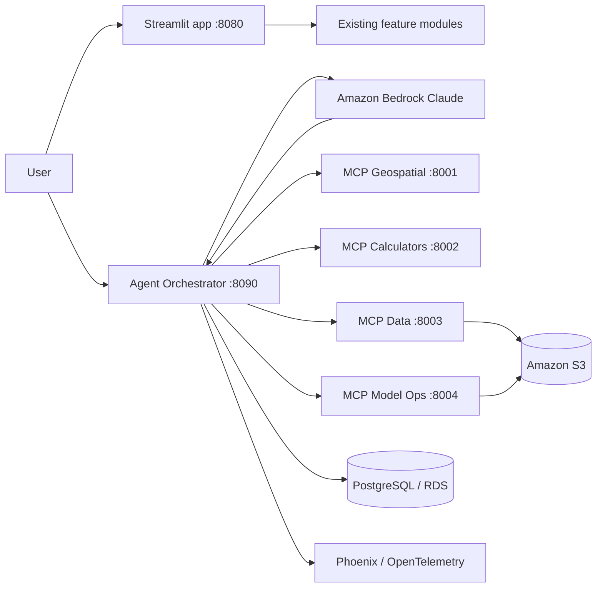
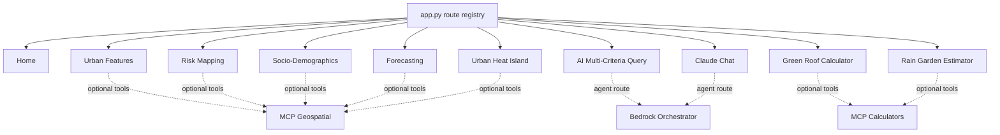
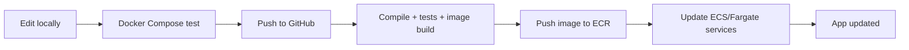
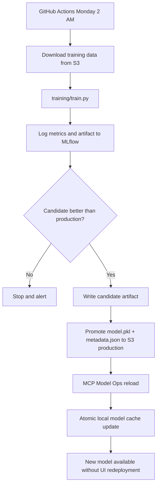

# Agentic Architecture and Functionality Preservation

## Design decision

The Streamlit application remains the user interface and retains all existing routes. The agentic framework is an additive service layer: the Bedrock orchestrator calls bounded FastMCP servers, while the original feature modules remain directly callable by `app.py`. This avoids turning every UI render function into a remote network dependency and protects existing behavior during the transition.

## End-to-end architecture



## Existing functionality ownership



## Code deployment flow



The prior Elastic Beanstalk workflow remains in the repository for continuity, but the uploaded framework points toward ECS/Fargate or EC2 multi-container deployment. A production migration should replace the Beanstalk step with ECR plus ECS task-definition updates.

## Weekly model training and promotion



## Repository organization

```text
app.py                              Existing thin UI router; unchanged
src/resilience_app/features/       Existing ten feature modules; unchanged
src/resilience_app/core/           Existing shared geospatial and Bedrock logic
src/resilience_app/services/       Existing S3 data/model services
agentic/
├── orchestrator/
│   ├── api.py                      FastAPI/Uvicorn agent endpoint
│   ├── bedrock.py                  Bedrock Claude client boundary
│   └── service.py                  Orchestration boundary
├── mcp_servers/
│   ├── geospatial.py               Mapping/forecast tool boundary
│   ├── calculators.py              Green roof/rain garden tool boundary
│   ├── data_access.py              Approved local/S3 data retrieval
│   └── model_ops.py                Production metadata and reload
├── common/
│   ├── settings.py                 Environment-based configuration
│   ├── aws_clients.py              Bedrock, S3, Secrets Manager
│   └── observability.py            Phoenix/OpenTelemetry setup
└── db/
    ├── models.py                   Agent run schema
    ├── session.py                  Async PostgreSQL sessions
    └── init_db.py                  Schema initialization
```

## S3 layout

```text
s3://<bucket>/nyc-resilience/
├── data/current/                   Runtime data with stable keys
├── data/versions/<date>/           Immutable snapshots
├── training/<dataset-version>/     Weekly training inputs
├── models/candidates/<run-id>/     Candidate model + metrics
├── models/production/              model.pkl + metadata.json
├── agent-artifacts/<session-id>/   Optional generated files
└── deployments/                    Release artifacts, when retained
```

## Safety and preservation controls

- `legacy/app_monolith_original.py` remains intact.
- `app.py` and every file under `src/resilience_app/features/` are byte-for-byte unchanged from the previous refactored ZIP.
- Tests assert all ten route keys and all ten feature entry-point functions.
- Phoenix initialization is fail-open so tracing outages do not stop the application.
- Agentic services are separate containers, so MCP or PostgreSQL failures do not remove the original Streamlit feature pages.
- Model reload remains a separate operation from code deployment.
