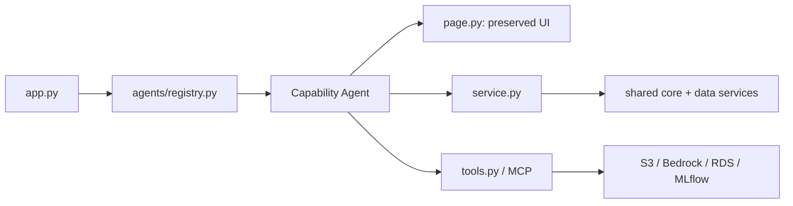

# Agent-Owned Architecture (v2)

All original Streamlit page implementations now live under `src/resilience_app/agents/<capability>_agent/page.py`. The old `features/*.py` paths remain as compatibility wrappers, so existing imports and teammate branches do not break.

## Route ownership

| Route | Agent |
|---|---|
| Home | `home_agent` |
| Urban Features | `urban_features_agent` |
| Risk Mapping | `flood_risk_agent` |
| Socio-Demographics | `demographics_agent` |
| Forecasting | `forecasting_agent` |
| Urban Heat Island | `heat_agent` |
| Multi-risk Identification Tool | `ai_query_agent` |
| Green Roof Calculator | `green_roof_agent` |
| Rain Garden Estimator | `rain_garden_agent` |
| Chat | `chat_agent` |

Each capability package contains `page.py`, `service.py`, `tools.py`, `schemas.py`, and optional `mcp_server.py`. Existing behavior remains in `page.py`; future reusable business logic should migrate incrementally into `service.py` with tests.

## Preservation strategy

1. The original monolith is retained in `legacy/`.
2. Page implementations were copied without logic edits into agent packages.
3. Old feature module names remain import-compatible.
4. A central registry retains all ten route keys.
5. Automated tests validate route inventory, entry points, wrappers, and legacy retention.
