# Functionality and Pipeline Flowcharts

## 1. Integrated application routing

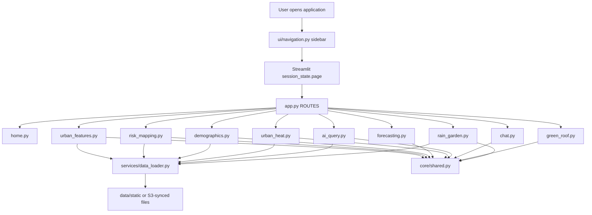

## 2. Urban Features

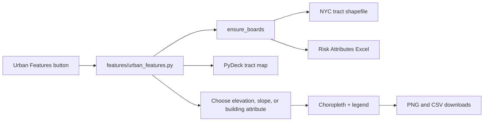

## 3. Risk Mapping

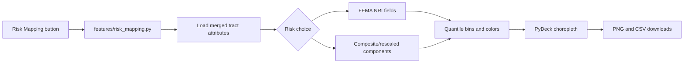

## 4. Socio-Demographics

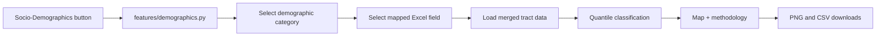

## 5. Rainfall Forecasting — current rule engine

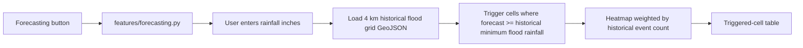

This is preserved behavior and is not currently connected to `model.pkl`.

## 6. Urban Heat Island

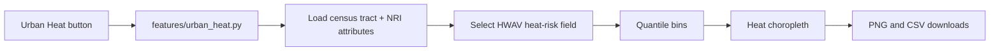

## 7. AI Multi-Criteria Query

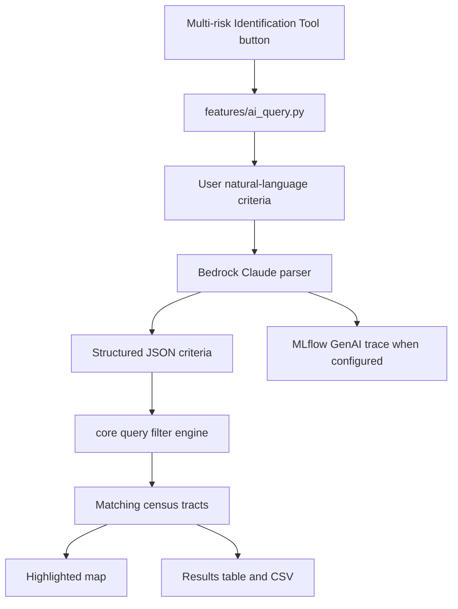

## 8. Chat

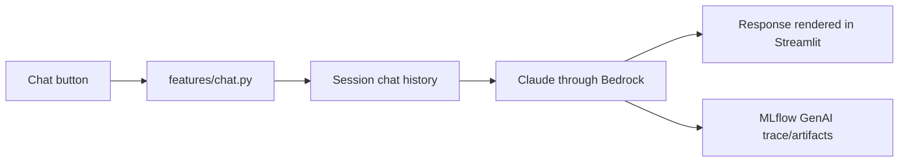

## 9. Green Roof Calculator

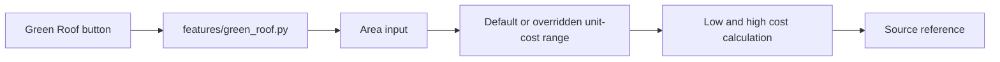

## 10. Rain Garden Estimator

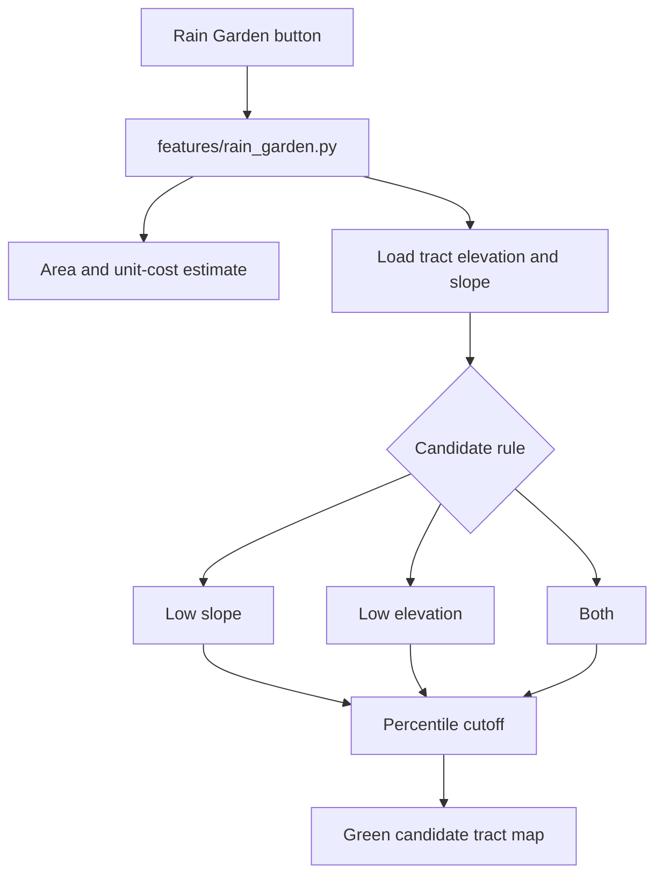

## 11. Code deployment workflow

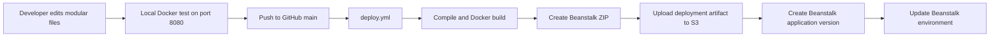

## 12. Weekly model workflow

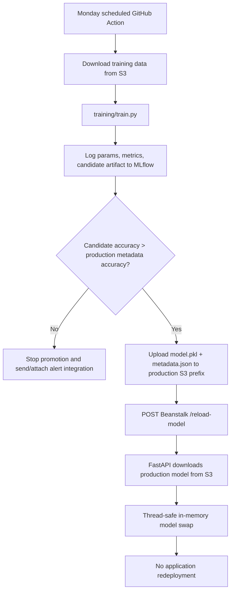
