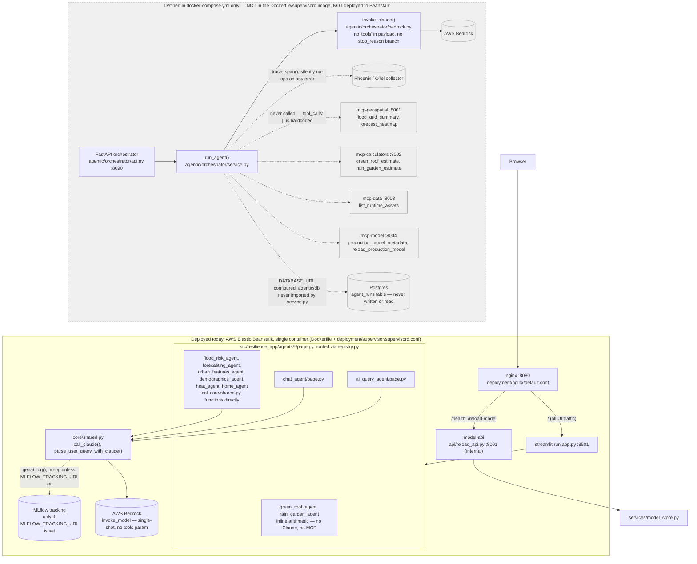
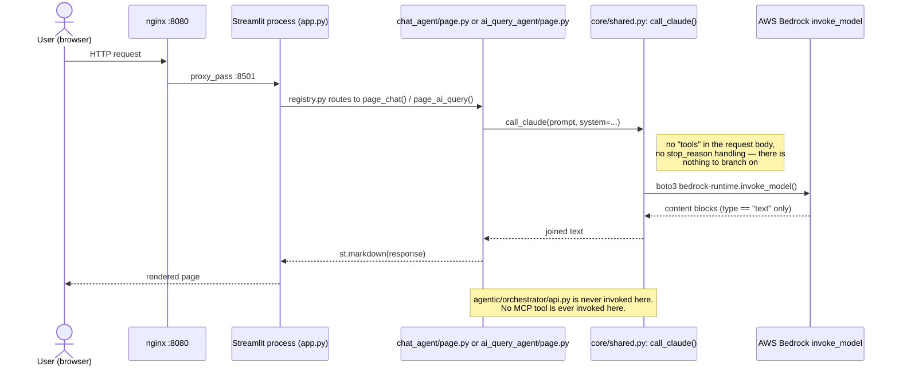

# Current Architecture Review — Agent Orchestration

Scope: how a request actually moves through this system today, verified by reading
code (not docs, not docker-compose intent). All file:line references point at the
current `main` branch (commit `a154727`).

## Correcting the starting assumptions

The brief assumed *"a chat path through the orchestrator that currently has no
tool access."* That's not what the code does. There is no chat path through the
orchestrator at all — `agentic/orchestrator` is never called by anything in
`src/` or `app.py` (repo-wide grep for `agentic.orchestrator`, `/v1/agent`, and
port `8090` outside the `agentic/` package itself returns zero hits). The
Streamlit chat and AI-query pages call AWS Bedrock **directly**, in-process,
via a second, completely separate Claude-calling implementation in
`src/resilience_app/core/shared.py`.

It's also not just "MCP servers running but not called" — they aren't even
started in the deployed system. `docker-compose.yml` is a local-only,
multi-container definition. The actual production artifact (built by
`.github/workflows/deploy.yml`, deployed to Elastic Beanstalk) is the single
Docker image whose `supervisord.conf` starts exactly three processes:
Streamlit, a small model-reload FastAPI (`api/reload_api.py`), and nginx.
Nothing in that image runs the orchestrator, any MCP server, Postgres, or
Phoenix. `deployment/ecs/README.md` confirms this is intentional/aspirational:
it describes what *would* need to be built on ECS for the orchestrator/MCP/RDS
architecture to run in AWS, and explicitly says the Compose-to-ECS path is
"retired."

So the honest framing isn't "two paths, one degraded" — it's **one live path**
(Streamlit → Bedrock, no tools, no orchestrator) and **one entirely dormant
subsystem** (`agentic/`) that isn't wired into anything, isn't deployed
anywhere, and — even taken on its own terms, running locally via
docker-compose — still has no code that calls Bedrock with tools, calls any
MCP server, or writes to its own database.

## Diagram 1 — system-wide reality map

## Diagram 2 — the one live Claude-backed request path

## Gaps between what's configured/running and what's wired into code

**1. Chat and AI-query pages bypass the orchestrator entirely — there's no
"chat path through the orchestrator" at all.**
`chat_agent/page.py:72` calls `call_claude()` directly.
`ai_query_agent/page.py:39` calls `parse_user_query_with_claude()`
(`core/shared.py:1792`), which itself calls `call_claude()`
(`core/shared.py:112`). Both hit Bedrock directly via boto3, in-process.
Repo-wide grep for `agentic.orchestrator`, `/v1/agent`, and `8090` outside
`agentic/` itself: zero matches in `src/` or `app.py`.

**2. `agentic/orchestrator` is not part of the deployed system.**
The production image's `deployment/supervisor/supervisord.conf` starts only
`streamlit`, `model-api` (`api/reload_api.py`), and `nginx`. There is no
`uvicorn agentic.orchestrator.api:app` process anywhere in the Dockerfile or
supervisord config that Beanstalk actually runs. The orchestrator, the four
MCP servers, Postgres, and Phoenix exist only as `docker-compose.yml:15-93`
services — a local dev definition, not something CI builds or deploys
(`.github/workflows/deploy.yml` builds the plain `Dockerfile` image and ships
it to Elastic Beanstalk; it never touches `docker-compose.yml`).
`deployment/ecs/README.md` confirms an AWS version of this architecture
doesn't exist yet ("retired" Compose-to-ECS integration).

**3. `invoke_claude()` has no tool-calling machinery even in principle.**
`agentic/orchestrator/bedrock.py:12-18` — the Bedrock payload never includes a
`tools` key. `bedrock.py:20-21` only extracts `type == "text"` content blocks
from the response; a `tool_use` block would be silently dropped if one ever
came back, and there's no check of `stop_reason` anywhere. `service.py:9`
hardcodes `"tool_calls": []` independent of whatever `invoke_claude` returns —
so even fixing the payload wouldn't surface anything without also rewriting
`service.py`'s response shape.

**4. The four MCP servers are unreachable from anywhere in the codebase, not
just "not called from the agent loop."**
Grep for the MCP URL settings (`settings.py:14-17`) and for any HTTP/FastMCP
client call to ports 8001-8004/8011-8014 turns up zero call sites outside the
servers' own `__main__` blocks. `agentic/mcp_servers/geospatial.py:1-8` and
`calculators.py:1-8` are "compatibility" shims that just re-register tool
functions already defined in
`src/resilience_app/agents/{flood_risk,forecasting,green_roof,rain_garden}_agent/mcp_server.py`
— an extra layer with no caller on either end.

Where the Streamlit UI needs equivalent functionality, it calls the same
underlying functions directly instead of going through the MCP tool:
`forecasting_agent/page.py:12-16,73-85` calls `load_flood_grid` /
`compute_forecast_heatmap` in-process — the same two functions that
`forecasting_agent/mcp_server.py:5-9`'s `forecast_heatmap` tool wraps.

`green_roof_agent/page.py` and `rain_garden_agent/page.py` go further: their
on-screen calculators (`green_roof_agent/page.py:26-27` — plain
`area_sqft * unit_cost`) are a **different calculation** from the MCP tool's
`green_roof_estimate`/`rain_garden_estimate`
(`green_roof_agent/mcp_server.py:4-7`, `rain_garden_agent/mcp_server.py:4-6`,
which compute stormwater capture in gallons). The MCP tools aren't just
unreachable — they compute something the UI never shows anywhere.

**5. Observability is split across two disconnected systems, and the "real"
one (OTel/Phoenix) never fires in production.**
`trace_span()` (`agentic/common/observability.py:18-27`) is only invoked from
`orchestrator/service.py:7`, which is itself unreachable (gap #2), so Phoenix
never receives a span in the deployed app. `trace_span` also swallows all
exceptions and yields `None` (`observability.py:26-27`), so even in local
docker-compose use, an unreachable Phoenix collector fails silently with zero
visible error and zero trace.

The Claude calls that actually run in production are logged through an
entirely separate mechanism: `genai_log()` (`core/shared.py:159-191`) writing
MLflow spans/runs — and only if `MLFLOW_TRACKING_URI` is set, which is blank
by default (`.env.example`). If it's blank, `genai_log()` returns immediately
(`core/shared.py:164-165`) and nothing is recorded at all. Net effect: in a
default deployment, neither tracing system captures anything.

**6. `DATABASE_URL`/Postgres is fully configured but has no live code path —
including inside the dormant orchestrator itself.**
`settings.py:9` defines `database_url`; `docker-compose.yml:70-83` runs a
`postgres` service; `.env.example` sets `DATABASE_URL`/`POSTGRES_DB`/etc.
`agentic/db/models.py:10-17` defines an `AgentRun` table (`session_id`,
`request_text`, `response_text`, `tool_calls`) clearly meant to persist
orchestrator runs. `agentic/db/session.py:4-5` builds an async engine and
sessionmaker at import time; `init_db.py` is a standalone script to create the
schema. Grep confirms no file outside `agentic/db/` imports
`agentic.db.session`, `agentic.db.models`, `get_session`, or `SessionLocal` —
not even `agentic/orchestrator/service.py`, the obvious place to write an
`AgentRun` row per request. Nothing ever writes to or reads from
`agent_runs`.

**7. `session_id` is accepted but stateless even where it's used.**
`api.py:27` accepts `session_id` (or mints one via `uuid4`) and passes it to
`run_agent` (`service.py:5,8`), which only uses it as a trace attribute and
echoes it back in the response dict (`service.py:9`). Consistent with gap #6,
there's no lookup or persistence of prior turns tied to that ID anywhere —
multi-turn "sessions" don't exist even within the disconnected orchestrator's
own design.

## What's actually true today, in one paragraph

A user request only ever goes: browser → nginx → Streamlit → (for
`green_roof`/`rain_garden`, pure inline arithmetic) or (for
`flood_risk`/`forecasting`/`urban_features`/`demographics`/`heat`/`home`,
direct in-process calls into `core/shared.py` data/geometry helpers) or (for
`chat`/`ai_query`, a direct in-process boto3 call to Bedrock via
`call_claude()`, no tools, single-shot). The entire `agentic/` package
(orchestrator, Bedrock tool-use scaffold, four MCP servers, Postgres-backed
run logging, OTel/Phoenix tracing) is real code that runs if you invoke it
directly or via `docker-compose up`, but it is not started in production, not
called by the production UI, and — even running locally — has no wiring
between its own pieces: the orchestrator doesn't call the MCP servers, doesn't
pass tools to Bedrock, and doesn't write to its own database.
